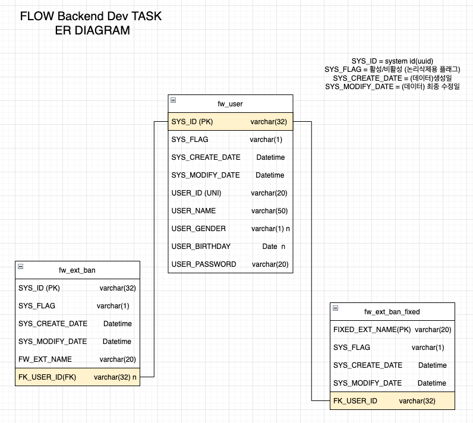

### 안녕하세요 서준희입니다.
###### 
###### 먼저, 좋은 기회를 만들어 주셔서 정말 감사합니다.
###### node.js와 express를 이용하여 이번 과제를 수행하였습니다. 
###### dataBase는 mysql@5.7 을 용했습니다.
  
 
 
 
 
   
##### erd 입니다.
######    
###### 
###### 
###### fw_user, fw_ext_ban, fw_ext_ban_fixed 총 3개의 테이블을 만들었습니다.  
###### 공통필드는 SYS_ID, SYS_FLAG, SYS_CREATE_DATE, SYS_MODIFY_DATE로 총 4가지 입니다.    
###### SYS_ID는 primary key로 데의터 고유 아이디입니다. UUID에서 하이픈을 지운 값을 return해주는 getNewID라는 함수를 만들어 insert될 때마다 고유 아이디를 부여하게 만들었습니다.  
###### SYS_FLAG는 논리삭제를 위한 값 입니다. SYS_FLAG가 1이면 활성, 0이면 삭제 입니다. 물리적인 삭제가 없기때문에 모든 데이터가 기록에 남아, 데이터 CRUD에 대한 로그를 따로 만들지 않기위해 구현하였습니다.
###### SYS_CREATAE_DATE는 데이터가 생성된 날짜입니다. 
###### SYS_MODIFY_DATE는 데이터가 수정된 날짜입니다.
###### FK_USER_ID는, fk_user테이블의 데이터와 관계mapping을 위해 만든 column입니다. user의 SYS_ID값이 저장되며, 추후 로그인 기능이 구현될 때 회원간의 데이터 구분이 필요하다고 생각되어 구현하였습니다.

 
 
 
 
 
 

#### 실행 방법
###### git clone 후 flow_backend_juny/server 경로에서 npm i 실행  
###### DB생성정보 
> host: 'localhost',  
  user: 'root',  
  password: '',  
  database: 'flow',  
  port: 3306
###### clone받은 폴더에 있는 flowDDL의 내용을 DB에서 실행  
###### flow_backend_juny/server 경로에서 npm start실행
###### localhost:9298 접속

 
 
 
 
 
 

#### 요건
<!--  -->
#### 1-1 고정 확장자 구현
###### 커스텀 확장자 차단 영역에 출력되지 않기 위해 새로운 테이블을 하나 더 만들었습니다.
###### checkbox 클릭시 바로 저장, 업데이트 되는 로직을 만들고 싶었는데, 여러개의 체크박스의 이벤트를 컨트롤 하는 방법을 몰라, 화면 구현에 적지 않은 시간을 썼습니다.  
<!-- ###### checkbox 클릭시 해당 영역의 value가 변경되도록 만들었는데, 생각했던 것과는 다르게 클릭하는 순간 onclick이벤트를 발생시키고, 값을 변경하여 의도한것과는 반대로 작동하였습니다.  -->
<!-- ###### 체크박스별 이벤트 발생시키는 법을 몰라 결국 체크박스 각각 아이디를 만들고 각각 onclick event를 매핑해주는 소위말하는 노가다를 했습니다. -->

 

<!--  -->
#### 2-1 확장자 최대 입력
###### html태그를 이용해 20자로 제한하였고, input받을 때 서버에서 length check를 합니다. 또한 data type을 varchar(20)으로 설정하였습니다.  

 

<!--  -->
#### 2-2 추가버튼 누르면 저장
###### fetch함수를 이용해 데이터를 가져왔고, 가져온 데이터의 길이만큼 forEach문을 실행해 화면 중앙에 구현한 html table을 추가하는 형식으로 구현하였습니다.

 

<!--  -->
#### 3-1 custom extension 200개 제한
###### return받은 데이터의 길이를 확인 후 200을 초과한다면 에러메세지를 띄우게 하였습니다.  

 

#### 3-2 확장자 옆 X 버튼
###### 화면 구현에 실패해서 delete버튼으로 대체하였습니다.  
###### 2-2에서 html table (조회된 데이터 출력)을 생성할 때 html내부에 해당 데이터의 id를 삽입하였습니다. delete버튼 클릭시 해당 아이디로 delete함수를 호출해 삭제합니다.  
###### edit버튼도 동일한 방법으로 구현하였습니다. edit버튼은 현재 주석처리 되어있으며,  
###### flow_backend_juny/server/client 경로의 [index.js 183번 라인], [index.html 59번 라인] 주석 해제시 update버튼이 화면에 출력됩니다.

 
 
 
 

#### 생각
###### 만들고싶은 기능은 많았는데, 시간분배를 잘못해서 구현하지 못한것이 많습니다. 
###### * 이름 중복체크  
###### * sql injection(처음엔 injection 유발 특수문제 replace했으나, 그냥 텍스트 박스에서부터 막아버림)  
###### * 커스텀 차단의 경우 물리삭제 없음 논리삭제만 - 나중에 사용자가 자기는 차단 안했는데 ~~~ 또는 차단 했다가 옛날에 지웠는데~~~ 등 로그를 위함  
###### * 확장자명 영어+숫자만 가능하게  
###### * docker... 올리려고 했지만,, 잘 안되서... 에러핸들링을 못해서... 걍 로컬에서 돌리는걸로...  
###### * 검색 기능도 만들었는데 만들고보니 ctrl+f로 찾으면 되서.. 뻄....  
